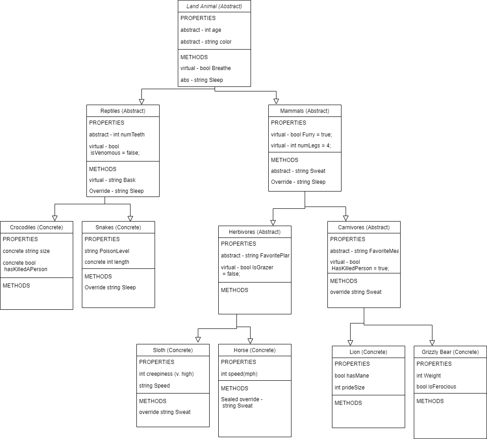

# Lab 06 - OOP Principles

*Author: Nicco Ryan & Michael Refvem*

----

## Description
### This is a console application made to simulate a zoo in order to showcase the principles of OOP.
---

### Getting Started
Clone this repository to your local machine.

```
$ git clone https://github.com/Niccoryan0/Lab06-OOPPrinciples.git
```

### To run the program from Visual Studio:
Select ```File``` -> ```Open``` -> ```Project/Solution```

Next navigate to the location you cloned the Repository.

Double click on the ```Lab06-OOPPrinciples``` directory.

Then select and open ```Lab06-OOPPrinciples.sln```

---

### Visuals

#### UML



---

### Change Log
1.0: *Initial release* - 13 July 2020